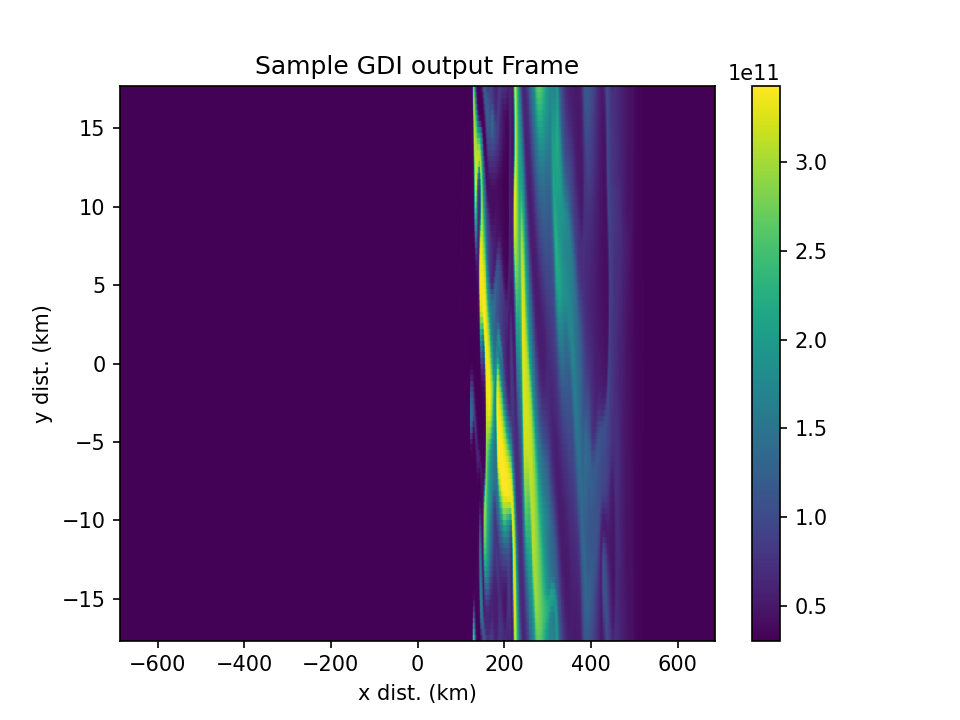

# Gradient-drift Instability Examples for Testing E-region Effects

This example collects together examples for testing how GDI attached to polar cap patches is impacted by a conductive E-region (the E-region shorting phenomena).  The E-region density is controlled by modifying the flat energetic percipitation used throughout all simulations.

This example uses a 3 step process for a GEMINI run:

1. Equilibrum - The "base" ionosphere is configured and the simulation is allowed to run long enough to come to a state of quasi-equilibrium.
2. Staging - The large scale perturbations (patches) are added to the end state of the equilibrium run and the simulation runs several minutes to "settle".  It is not possible to let the simulation in this stage come to a state of true equilibrium because the existance of a large-scale density enhancement is inherently unstable, but you don't want any large transients due to the sudden addition of the patch.
3. Perturbation - The small-scale perturbations (noise) are added on top of the end state of the staging run and an electric field is imposed which drives the actual instability.  This is the only step where GDI is actually active.

## Equilibrium
Example setup for the equlibrium run is provided in the `eq` folder.  Only the config file included is needed.  If you wish to change the E region density, you will have to modify the precipitation characteristics included in this config file and the others used to set up the other steps.  This simulation will need to run for several hours of simulation time, but it can be done at extremely corse spatial resolution.

## Staging
Example setup for the staging run is provided in the `GDI_planar` folder.  This includes both a config file and `perturb_GDI_planar.py`.  The perturbation file is specified in the config file.  To modify the characteristics of the patch (size, location, ect), you will have to modify this python script.  The resolution used for this simulation can be corser than what is used in the final GDI simulation, but it must be fine enough to resolve the patch edge gradients.

## Perturbation
Example setup for the perturbation run is provided in the `perturb` folder.  This includes both a config file and `perturb_add_noise.py`.  The perturbation file is specified in the config file.  Gaussian random noise is added across the simulation space, but the relative amplitude of the noise (usually set around 1%) can be adjusted in the python script.

Throughout this example, we'll assumed you're working under directory $HOME/gemini.
This notation works across operating systems (Windows, Linux, macOS).
You can use "~/gemini" as a shorthand notation.
On Windows, please use PowerShell (built into all Windows computers), not Command Prompt.
On macOS or Linux, the default Terminal shell will work.

```sh
mkdir $HOME/gemini

cd $HOME/gemini
```

You will also need the files in this directory to set up the three simulations; these are most easily obtained by cloning the
[gemini-examples](https://github.com/gemini3d/gemini-examples) repository.

```sh
git clone https://github.com/gemini3d/gemini-examples
```

Alternatively one could simply copy the source files from the GitHub webpage.

Core GEMINI code installation details are covered in the
[GEMINI](https://github.com/gemini3d/gemini)
repository; he we provide an brief summary.
Once you have installed a compiler (gcc recommended), mpi implementation (openmpi recommended), and cmake you can pull the GEMINI repository, configure, and compile.

```sh
git clone https://github.com/gemini3d/gemini3d

cmake -S gemini3d -B gemini3d/build

cmake --build gemini3d/build -j
```

Finally, you will need the PyGemini front- and back- end scripting for prepping input data and plotting; this requires an existing Python installation.

```sh
git clone https://github.com/gemini3d/pygemini

pip install -e ./pygemini
```

## Three-phase simulation
This simulation must be run in three steps:
- Eqilibrium - estabilish background and stable E-region
- Staging - add patch
- Perturbation - add noise

To generate different E-region conductivities, change E0 and Q in the configuration files and re-run all three simuations.


## Creating input data for simulation

Initial conditions for these simulations for a specific grid size, etc., are created from existing, low-resolution "equilibrium" simulations.
These could be manually downloaded from
[Zenodo](https://zenodo.org/records/11509797) (archival, slower)
or
[Dropbox](https://www.dropbox.com/scl/fo/d2b0so28oom1cfr3jlzhz/AI1l23BNLSrqcrtqru4lEDo?rlkey=t6ko7zy6xfmkw9rpmpzh2yqjt&e=1&st=yziwgr4p&dl=0) (faster, but might have been removed).

You can use Curl from the command line as below, or click the links above.

```sh
curl -o cedar2024_gemini_examples.zip -L "https://zenodo.org/records/11509797/files/CEDAR2024_examples.zip?download=1"
```

Extract the ZIP file to wherever you like.
This can be done from the command line with any one of the following commands:

```sh
unzip cedar2024_gemini_examples.zip
# or
tar xf cedar2024_gemini_examples.zip
# or
cmake -E tar xf cedar2024_gemini_examples.zip
```

The two directories thereby extracted are "ESF_CEDAR2024" and "ESF_eq_CEDAR2024".

Edit the `eq_dir` variable in the `config.nml` file for whichever example you want to run.
Make `eq_dir` point to the filesystem directory where you have extracted the equilibrium data .zip file.

Once these are obtained one can run the setup for one of the instability simulations.
Here we will use the ESF example.

To use the custom function "perturb_ESF.py", either run from the directory containing the custom function, or add the function path to Python path.
It's best to make custom functions have distinctive names otherwise another function might be loaded with the same name!

Run from Python interpreter like:

```python
import gemini3d.model
import sys
from pathlib import Path

cfgdir = "~/gemini/gemini-examples/init/CEDAR2024/ESF_periodic_lowres"

fpath = Path(cfgdir).expanduser()

sys.path.append(str(fpath))

gemini3d.model.setup(fpath / "config.nml", "~/gemini/ESF_periodic")
```

This will generate grid, initial conditions, and boundary conditions information that the core GEMINI model will use for its simulation.


## Running the simulation

Navigate to the directory where the code was built and run it on the input data created.

```sh
cd $HOME/gemini/gemini3d/build/

mpirun -np 4 ./gemini.bin ~/ESF_periodic
```


## Gridding and plotting the output

Once the simulation has been run the
[./visualization.py](./visualization.py)
script shows how you can form datacubes (i.e. regularly gridded output in lat/lon) and then plot them.


